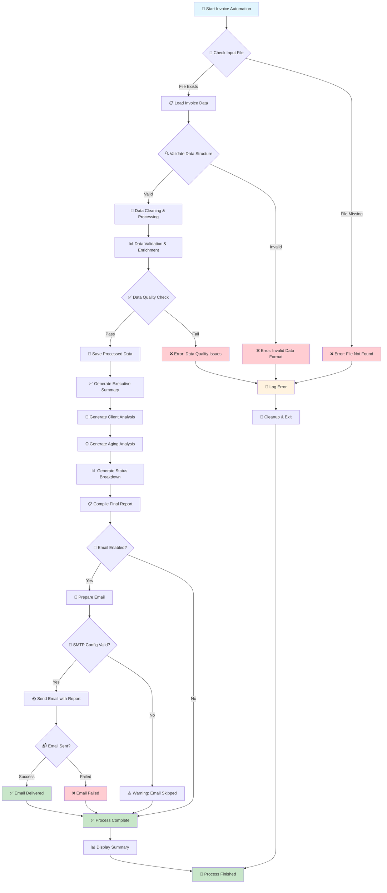
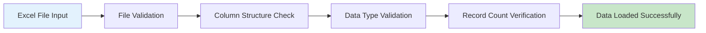
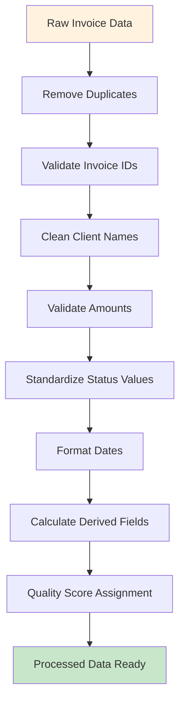
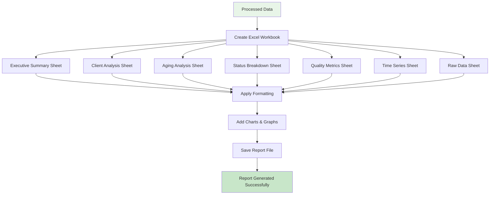
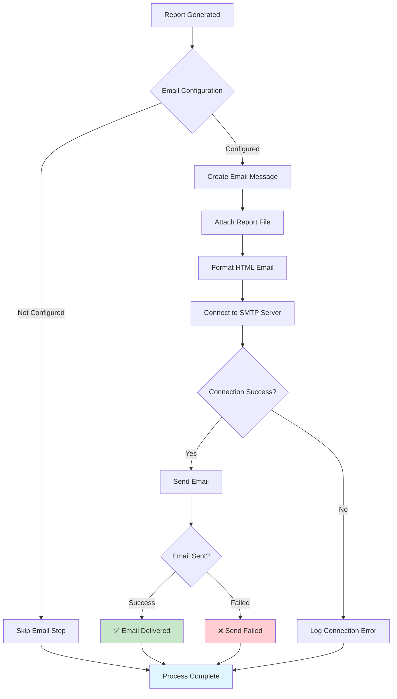
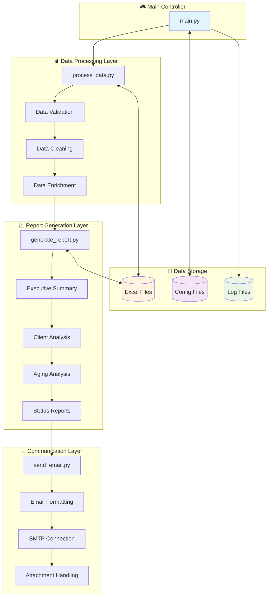
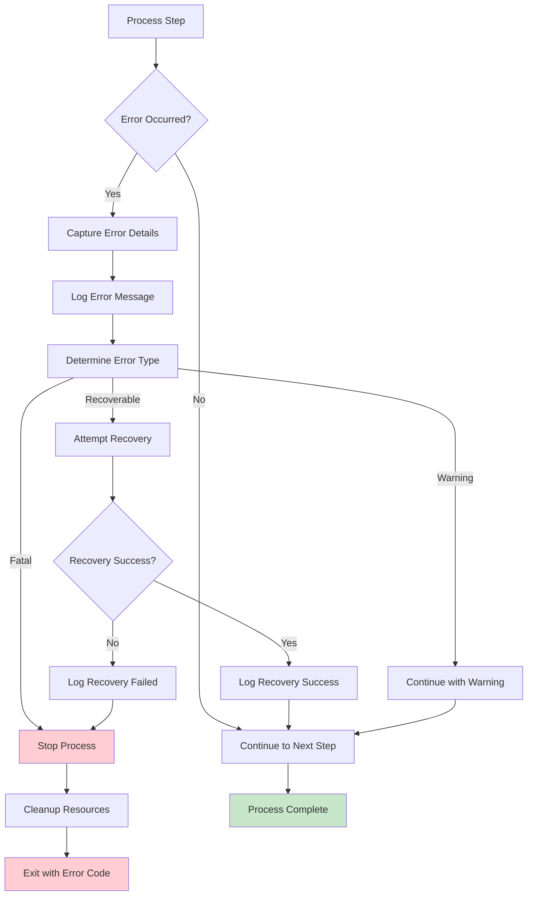
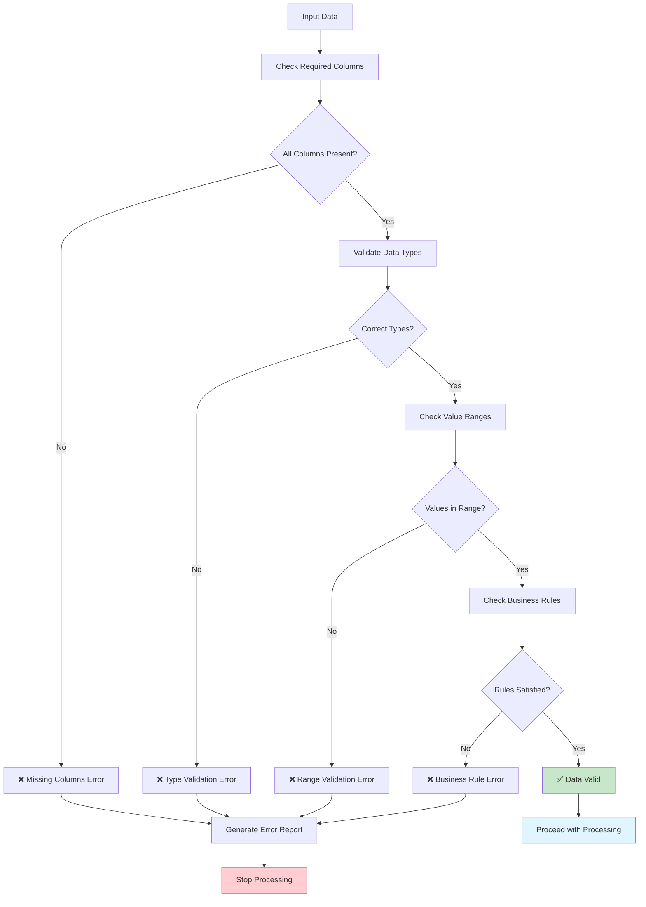
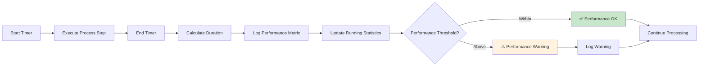

# 📊 Invoice Processing Automation - System Flowchart

## 🎯 Process Overview Flowchart

## 🔄 Detailed Process Flow

### 1. 📥 Data Ingestion Phase

### 2. 🧹 Data Processing Phase

### 3. 📊 Report Generation Phase

### 4. 📧 Email Distribution Phase

## 🏗️ System Architecture Flow

## 📋 Error Handling Flow

## 🔍 Data Quality Validation Flow

## 📈 Performance Monitoring Flow

---

## 📝 Flow Legend

| Symbol | Meaning |
|--------|---------|
| 🚀 | Start/Initialization |
| 📂 | File Operations |
| 🔍 | Validation/Checking |
| 🧹 | Data Processing |
| 📊 | Analysis/Calculation |
| 📈 | Report Generation |
| 📧 | Email Operations |
| ✅ | Success State |
| ❌ | Error State |
| ⚠️ | Warning State |
| 🎉 | Completion |

---

*Generated for Concordia University RPA Course - Hassan Naeem*
