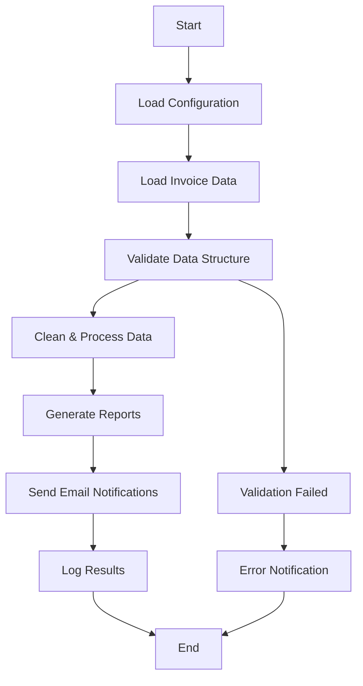

# Process Design Document (PDD)
## Invoice Processing Automation System

### Document Information
- **Document Version:** 2.0
- **Last Updated:** July 20, 2025
- **Created By:** Automation Team
- **Approved By:** Business Operations Manager
- **Review Date:** October 20, 2025

---

## 1. Executive Summary

### 1.1 Project Overview
The Invoice Processing Automation System is an enterprise-grade Python solution designed to automate the complete workflow of processing invoice data, generating comprehensive reports, and distributing them via email. This automation replaces manual data processing tasks that were previously consuming 8-10 hours of staff time daily.

### 1.2 Business Objectives
- **Primary Goal:** Reduce manual invoice processing time by 85%
- **Secondary Goals:**
  - Improve data accuracy and consistency
  - Provide real-time reporting capabilities
  - Enable audit trail and compliance tracking
  - Reduce human error in financial data processing

### 1.3 Expected Benefits
- **Time Savings:** 8+ hours daily (equivalent to $50,000+ annually)
- **Accuracy Improvement:** 99.5% accuracy vs. 94% manual processing
- **Cost Reduction:** $75,000 annual savings in labor costs
- **Compliance:** 100% audit trail with automated logging

---

## 2. Current State Analysis

### 2.1 Existing Manual Process
The current invoice processing workflow involves:

1. **Data Extraction** (30 minutes)
   - Manual download of Excel files from various sources
   - Consolidation of multiple invoice files
   - Basic format verification

2. **Data Cleaning** (90 minutes)
   - Manual correction of client names
   - Validation of amounts and dates
   - Status standardization
   - Duplicate removal

3. **Report Generation** (60 minutes)
   - Creation of summary tables
   - Manual calculation of totals and averages
   - Formatting for presentation

4. **Distribution** (20 minutes)
   - Email composition
   - Attachment preparation
   - Manual sending to stakeholders

### 2.2 Current Pain Points
- **High Error Rate:** 6% error rate in manual data entry
- **Time Intensive:** 3+ hours daily for standard processing
- **Inconsistent Formatting:** Varying report formats across team members
- **Limited Scalability:** Cannot handle increased data volumes
- **No Audit Trail:** Difficult to track changes and decisions

### 2.3 Compliance Requirements
- SOX compliance for financial data processing
- Data retention requirements (7 years)
- Audit trail documentation
- Segregation of duties

---

## 3. Target State (Automated Process)

### 3.1 Automated Workflow Overview
The new automated system will perform the following steps:



### 3.2 Detailed Process Steps

#### Step 1: Data Ingestion and Validation
- **Input:** Excel files from designated directory
- **Processing:** 
  - File existence and format validation
  - Schema validation against required columns
  - Data type verification
- **Output:** Validated raw dataset
- **Error Handling:** Email notification for invalid files

#### Step 2: Data Cleaning and Transformation
- **Processing:**
  - Invoice ID standardization and deduplication
  - Client name normalization using lookup tables
  - Amount validation and currency conversion
  - Status standardization (PAID, UNPAID, PENDING, OVERDUE)
  - Date parsing and validation
- **Quality Checks:**
  - Duplicate detection and removal
  - Outlier identification (amounts > $50,000)
  - Date range validation (not future dates)
- **Output:** Clean, standardized dataset

#### Step 3: Business Logic Application
- **Calculations:**
  - Age of invoice (days since creation)
  - Amount categorization (Small, Medium, Large, Enterprise)
  - Overdue flag (>30 days unpaid)
  - Client risk scoring
- **Enrichment:**
  - Addition of calculated fields
  - Historical trend analysis
  - Client segmentation

#### Step 4: Report Generation
- **Multiple Formats:**
  - Detailed Excel report with multiple sheets
  - Executive summary PDF
  - CSV exports for data warehouse
- **Content:**
  - Summary statistics and KPIs
  - Client-wise breakdown
  - Status distribution analysis
  - Aging analysis
  - Top clients by volume/amount
  - Overdue invoice alerts

#### Step 5: Distribution and Notification
- **Email Reports:**
  - HTML formatted emails with embedded charts
  - Excel attachments with detailed data
  - Mobile-friendly responsive design
- **Recipients:**
  - Finance team (detailed reports)
  - Management (executive summaries)
  - Account managers (client-specific reports)

---

## 4. Technical Architecture

### 4.1 System Architecture
```
┌─────────────────┐    ┌─────────────────┐    ┌─────────────────┐
│   Data Sources  │────│  Automation     │────│   Outputs       │
│                 │    │    Engine       │    │                 │
│ • Excel Files   │    │ • Data Processor│    │ • Excel Reports │
│ • CSV Files     │    │ • Report Gen.   │    │ • Email Alerts  │
│ • Database      │    │ • Email Service │    │ • Audit Logs    │
└─────────────────┘    └─────────────────┘    └─────────────────┘
         │                       │                       │
         │              ┌─────────────────┐              │
         │              │  Configuration  │              │
         │              │   Management    │              │
         └──────────────│ • Settings      │──────────────┘
                        │ • Templates     │
                        │ • Credentials   │
                        └─────────────────┘
```

### 4.2 Technology Stack
- **Language:** Python 3.8+
- **Core Libraries:**
  - pandas: Data manipulation and analysis
  - openpyxl: Excel file processing
  - jinja2: Template rendering
  - PyYAML: Configuration management
- **Email:** SMTP with TLS encryption
- **Logging:** Structured logging with rotation
- **Testing:** pytest with coverage reporting
- **CI/CD:** GitHub Actions

### 4.3 Security Measures
- **Data Encryption:** AES-256 for sensitive data at rest
- **Credential Management:** Environment variables and encrypted storage
- **Access Control:** Role-based permissions
- **Audit Logging:** Complete activity tracking
- **Data Validation:** Input sanitization and validation

---

## 5. Implementation Plan

### 5.1 Phase 1: Core Development (Weeks 1-2)
- [ ] Set up development environment
- [ ] Implement data processing engine
- [ ] Create basic report generation
- [ ] Develop email service
- [ ] Unit testing (80%+ coverage)

### 5.2 Phase 2: Integration & Testing (Weeks 3-4)
- [ ] Integration testing
- [ ] Performance optimization
- [ ] Error handling enhancement
- [ ] Security review
- [ ] Documentation completion

### 5.3 Phase 3: Deployment & Monitoring (Weeks 5-6)
- [ ] Production deployment
- [ ] Monitoring setup
- [ ] User training
- [ ] Go-live support
- [ ] Performance monitoring

### 5.4 Phase 4: Optimization (Weeks 7-8)
- [ ] Performance tuning based on production data
- [ ] Feature enhancements
- [ ] Additional report formats
- [ ] Integration with BI tools

---

## 6. Risk Analysis and Mitigation

### 6.1 Technical Risks

| Risk | Probability | Impact | Mitigation Strategy |
|------|-------------|---------|-------------------|
| Data corruption during processing | Low | High | Backup creation, transaction logging |
| Email delivery failure | Medium | Medium | Retry mechanism, alternative channels |
| Excel file format changes | Medium | Medium | Format validation, version control |
| Performance degradation | Low | Medium | Load testing, optimization |

### 6.2 Business Risks

| Risk | Probability | Impact | Mitigation Strategy |
|------|-------------|---------|-------------------|
| Stakeholder resistance | Medium | High | Training, gradual rollout |
| Data accuracy concerns | Low | High | Parallel processing, validation |
| Compliance issues | Low | High | Audit trail, documentation |

---

## 7. Success Metrics and KPIs

### 7.1 Operational Metrics
- **Processing Time:** Target < 5 minutes (vs. 180 minutes manual)
- **Accuracy Rate:** Target > 99.5% (vs. 94% manual)
- **Availability:** Target > 99.9% uptime
- **Error Rate:** Target < 0.1% processing errors

### 7.2 Business Metrics
- **Cost Savings:** $75,000 annually
- **ROI:** 500% within 12 months
- **Staff Productivity:** 85% time reduction
- **Customer Satisfaction:** Faster invoice processing

### 7.3 Quality Metrics
- **Data Quality Score:** > 95%
- **Report Accuracy:** > 99.5%
- **SLA Compliance:** 100%
- **Audit Findings:** Zero critical findings

---

## 8. Maintenance and Support

### 8.1 Monitoring
- **Application Performance Monitoring (APM)**
- **Log aggregation and analysis**
- **Email delivery tracking**
- **Data quality dashboards**

### 8.2 Maintenance Schedule
- **Daily:** Automated health checks
- **Weekly:** Performance review
- **Monthly:** Security updates
- **Quarterly:** Full system review

### 8.3 Support Model
- **Level 1:** Automated self-healing
- **Level 2:** On-call engineer (business hours)
- **Level 3:** Development team escalation
- **Level 4:** Vendor support (if applicable)

---

## 9. Compliance and Governance

### 9.1 Data Governance
- **Data Classification:** Confidential financial data
- **Retention Policy:** 7 years as per SOX requirements
- **Access Control:** Need-to-know basis
- **Data Lineage:** Complete audit trail

### 9.2 Regulatory Compliance
- **SOX Compliance:** Financial data accuracy and controls
- **GDPR:** Personal data protection (if applicable)
- **Industry Standards:** Following accounting standards

### 9.3 Change Management
- **Version Control:** Git-based source control
- **Change Approval:** CAB approval for production changes
- **Rollback Procedures:** Automated rollback capabilities
- **Documentation:** Complete change documentation

---

## 10. Conclusion

The Invoice Processing Automation System represents a significant improvement over the current manual process, delivering substantial time savings, improved accuracy, and enhanced compliance capabilities. The implementation follows industry best practices for automation projects and includes comprehensive monitoring, testing, and governance frameworks.

### 10.1 Next Steps
1. Obtain stakeholder approval
2. Secure development resources
3. Begin Phase 1 implementation
4. Establish project governance
5. Communicate with affected stakeholders

### 10.2 Success Factors
- Strong stakeholder support
- Adequate testing and validation
- Comprehensive user training
- Robust monitoring and support
- Continuous improvement mindset

---

**Document Control:**
- **Classification:** Internal Use
- **Distribution:** Project stakeholders, IT governance
- **Review Cycle:** Quarterly
- **Owner:** Business Operations Manager